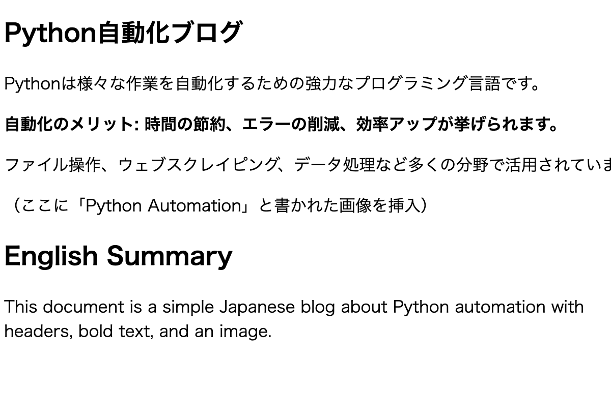

# DocX から HTML 変換ツール

## 必要な依存関係
- Python3  
- python-docx（pipでインストール可能）

## 処理内容
- ブログ用テンプレートの `.docx` ドキュメントを基本的な HTML に変換します。
- 次のルールに基づいて変換されます：
  - 文字サイズが 12 以上 → `<h2>` 要素に変換  
  - 文字サイズが 11 かつ **太字** → `<h3>` 要素に変換  
  - 文字サイズが 11 以下 → `
` 要素に変換  
  - 太字のテキストには `class="bold"` を付与  

## この変換ツールの弱点
- 上記以外の要素は無視されます  
- 複数行のテキストを別々の要素として扱ってしまうことがあります  
- ボックス内のテキストや画像など、文書のメイン部分以外のテキストは無視されます  
- 精度が低いです  

## 使用方法と注意点
`.docx` ファイルからテキストを素早く抽出し、ラフな HTML に変換するためのツールです。  
変換後の HTML は手動で確認・修正し、必要に応じて最終的な HTML ドキュメントに貼り付けてください。  
このツールは HTML タグの繰り返し入力や、フォントサイズごとのタグの確認作業を省くのに有効です。  
ただし、精度は高くないため、**必ず元の文書を参照しながら丁寧に編集してください。**

## 含まれているファイル
src.docx — ヘッダー、段落、太字テキスト、画像を含む日本語のサンプルドキュメントで、スクリプトのテスト用に含まれています

# DocX to HTML Converter

## Dependencies
- Python3
- python-docx (install with pip)

## Process
- Converts a blog template docx document to basic HTML.
- Converts with the following logic:
    - text size >=  12 to h2 element
    - text size 11 and bold = h3 element
    - text size <= 11 to p element
    - bold text recieves bold class

## Weaknesses of this converter
- Ignores all other elements
- Can treat multi-line text as separate elements
- Ignores text not in the primary focus of the document (eg. text in boxes, images)
- Innacurate

## Usage and Warning
Can be used to quickly take text from a docX file and parse it into rough HTML.
HTML can then be manually checked and pasted into taget HTML document with care.
This converter is effective at saving time typing HTML tags repeatitively and checking font-size for respective HTML tag.
This converter is not accurate, and creates an HTML-like document that must be edited thoughly while checking the orignal.

## Included File

src.docx — An example Japanese document (with headers, paragraphs, bold text, and an image) included for testing the script.